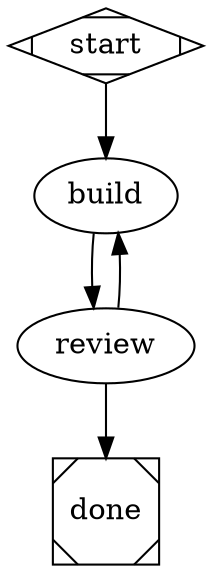

# Customization

Change the canonical source for the behavior you want; do not copy it into a
second location.

| Goal | Owner |
|---|---|
| shell or agent-harness behavior | `dotfiles/` |
| workflow execution or observation | `factory/` |
| independently installable capability | `skills/<goal>/` |
| durable decision or repository history | `docs/` |

## Workflow

DOT is the authored workflow. Start with the graph; add configuration only where
the state needs it:



Node blocks are expandable. Supported execution settings include `runner`,
`model`, `reasoning_effort`, `prompt`, `skills`, `max_retries`, `timeout`,
`resources`, `evidence`, and `exit_contract`:

```dot
build [
  type=agent,
  model="gpt-5.6-sol",
  prompt="prompts/build.md",
  skills="codebase-explore,swift-testing",
  max_retries=3
]

build -> build [on=retry]
build -> canceled [on=exhausted]
```

The exhaustion edge selects the destination. Put repeated settings in a named
JSON profile and reference it with `profile=builder`; a node value wins over its
profile. Workflow-wide `node [...]` defaults win over factory defaults and lose
to profiles.

Human-edge conventions keep the common graph small:

| Edge | Implied policy |
|---|---|
| `on=approve` | approver role and durable approval record |
| `on=revise` | durable changes-requested feedback |
| one unlabeled work exit | successful completion follows that edge |

Linear projection is optional. Add `linear_status` only when the workflow must
reconcile with a tracker; omit it from a local or starter graph.

Schema v2 removes repeated Linear policy from the authored graph:

```dot
graph [schema_version=2, conventions=linear, linear_statuses=node_ids]

Implementing -> Verifying [on=complete, authority="human,agent"]
Implementing -> Investigating [on=failed, authority="human,agent"]
Investigating -> @resume [on=retry]
```

| Shorthand | Expansion |
|---|---|
| `linear_statuses=node_ids` | Project each node to the same-named Linear status unless overridden. |
| `conventions=linear` | Derive Linear, control, listener, handoff, recovery, and comment signals from `on` and `authority`. |
| omitted edge `id` | Generate a stable ID from the source and target. |
| `@resume` | Expand to each incoming `on=failed` source with a `resume_state` condition. |

`@resume` requires `on=retry` and at least one incoming `on=failed` edge. The
generated workflow view shows every expanded edge, signal, condition, and
confirmation requirement.

Register DOT and profile files in `factory/factory.json`, then select a workflow
per project. Validate and render any graph:

```bash
python3 factory/render_workflow.py \
  --workflow factory/workflows/three-step.dot \
  --output /tmp/three-step.md
./factory/test.sh
```

The default view is generated from `factory/workflows/default.dot`. Do not edit
`factory/WORKFLOW.md` or the legacy `factory/workflow.json` compatibility fixture.

Schemas v1 and v2 reject unknown attributes, unsupported DOT syntax, missing
profiles, missing prompt files, unreachable nodes, ambiguous edges, graphs
without one entry, and nodes without a terminal path. V1 behavior is unchanged;
v2 adds the optional readability conventions above. Runner/model/skill
availability is a runner-adapter check. Resource names are validated against
factory capability configuration before activation; concrete device IDs,
ports, paths, and credentials never belong in DOT.

## Factory configuration

Copy `factory/factory.example.json` to the ignored `factory/factory.json`. Keep
reusable defaults in the example and local paths, tracker project IDs, startup
project selection, and environment-variable choices in the real configuration.

Schema v4 adds `preparation.workspace`, bounded preparation retry policy, named
providers, and logical capabilities. The default workspace root is the
project's ignored `.worktrees/` directory. A project may override root, remote,
base ref, or retention. Portless capabilities use an argv array, not a shell
string, and reject takeover or exposure flags.

Schema v5 adds `scheduler.poll_interval_ms`, `claim_ttl_seconds`, and host,
project, and runner admission limits. The scheduler reads runner names from the
attempt's stored resolved node; it does not branch on a provider or workflow
state name. Keep the host limit conservative until live adapters are measured.

Schema v6 adds the `runners` registry. Keep executable, minimum version,
profile, permission mode, and native capability declarations there. A node's
`runner` must resolve to one active registry entry before launch. Do not put
credentials, personal sessions, or executable paths in DOT.

Codex routes may set `disabled_mcp_servers`. In each prepared workspace, the
factory discovers configured servers with `codex mcp list --json`, disables
matching servers, withholds the remote URL and internal ID from the prompt, and
records the policy in the runner context. An absent server needs no override.
Discovery failure blocks launch. The prompt forbids browser, web, CLI, and API
fallbacks, but that part is cooperative unless a separate sandbox or network
policy enforces it. Disable `linear` when the durable kernel owns Linear
synchronization; disabling the projection alone does not disable a runner's
personal connector.

Linear projection configuration stores only environment-variable names and
stable remote IDs. Enabling it requires one team ID per Linear project. Project
preflight resolves every referenced workflow status to one exact status ID;
missing, duplicated, or wrong-team values stop that project lane.

The example OMP route uses the isolated `dotfactory-claude-api` profile and
names `ANTHROPIC_API_KEY` in `environment_envs`. Export the key in the Factory
process environment and configure the profile locally. The value is injected
only into the OMP child process; it is never written to the example, ledger,
command, receipt, or trace.

## Dotfiles

Keep portable behavior in `dotfiles/`. Keep credentials, OAuth state, machine
hooks, session history, and per-project trust outside the repository.

## Skills

Each capability owns its instructions, deterministic implementation,
integration guidance, and offline tests under `skills/<goal>/`. A capability is
portable only when another repository can install it using that folder alone.
