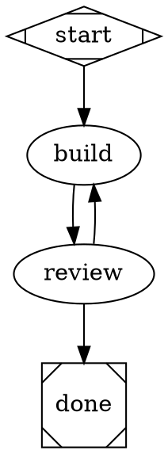

# ADR-0011: Author workflows as typed DOT graphs

| Field | Value |
|---|---|
| Status | Accepted |
| Date | 2026-08-29 |
| Deciders | Project maintainers |
| Source | Public baseline |
| Supersedes | [ADR-0006](0006-separate-checkpoints-work-and-edge-authority.md); the state-ID-to-Linear-status rule in [ADR-0008](0008-local-ledger-external-projections.md) |
| Amended by | [ADR-0014](0014-expand-readable-dot-before-execution.md) |

## Decision

Use a strict, versioned subset of Graphviz DOT as the canonical workflow
authoring format. Parse it into a normalized workflow definition, resolve its
configuration, validate it, and snapshot its digest before execution. The
durable kernel executes only that resolved snapshot.

A node ID is a stable internal state identity. `label` is mutable presentation.
Node `type` determines whether the state is active work, a durable human
checkpoint, a tool, control flow, entry, or a terminal outcome. Keep the
checkpoint/work distinction and edge authority from ADR-0006 as runtime
invariants rather than a fixed inventory of named states.

Node and edge attributes use a closed, typed schema. Extend the schema by
version; reject unknown attributes. Agent nodes may reference a named profile
with `profile` and may override prompt, skills, runner, model, reasoning effort,
retry limit, timeout, resources, evidence, and exit contract.

Resolve configuration in this order:

1. factory defaults;
2. workflow defaults;
3. named profile;
4. node overrides;

Run overrides are not accepted in schema v1. Add them only with an explicit
allowlist and snapshot semantics.

Persist the canonical DOT, normalized graph, workflow digest, and resolved node
configuration used by each execution or attempt. Later edits never reinterpret
prior history.

Linear is an optional projection of internal state. Multiple nodes may project
to one Linear status. Reverse routing requires one explicit, unambiguous mapping;
otherwise record and reject the observation rather than guess.

Convert the current workflow to the default DOT graph without changing its
behavior. Move approval, rework, retry, cancellation, feedback, evidence, and
role requirements from state-name branches into typed node and edge policy.

## Example



`on=approve` expands to the standard approver role and durable approval record.
`on=revise` requires durable changes-requested feedback. A work node with one
unlabeled exit follows it on successful completion.

The concise `build` node may expand without changing graph structure:

```dot
build [
  type="agent",
  runner="codex",
  model="gpt-5.6-sol",
  reasoning_effort="high",
  prompt="prompts/build.md",
  skills="codebase-explore,swift-testing",
  max_retries=3,
  timeout="30m",
  exit_contract="implementation-result-v1"
]

build -> build [on=retry]
build -> canceled [on=exhausted]
```

The exhaustion edge owns its destination. Named profiles are optional and use
`profile=builder`; extract one only when configuration repeats.

## Why

The graph must be easy to understand before it is easy to customize. DOT makes
states, branches, loops, and terminal paths visible in one small artifact. Typed
attributes add depth without requiring users to modify runtime code. A starter
workflow remains one DOT file; profiles remove repetition later.

A normalized intermediate representation keeps Graphviz syntax out of the
ledger and kernel. It also gives validation, rendering, hashing, tests, and
execution one exact graph to share.

## Consequences

- Good: a three-step flow and the dotfactory default use the same runtime.
- Good: one file is sufficient; profiles keep repeated settings readable.
- Good: renders, validation reports, and execution can share one digest.
- Good: internal workflow depth no longer expands the team's Linear vocabulary.
- Good: SQLite atomicity, attempts, fencing, evidence, leases, and outbox remain.
- Cost: dotfactory owns a strict DOT parser, typed schema, resolver, and diagnostics.
- Cost: the ledger must snapshot workflow and resolved execution configuration.
- Cost: control and reconciliation must derive behavior from policy instead of names.
- Not included: full Graphviz compatibility, unvalidated extension attributes,
  live runner adapters, condition nodes, run overrides, or state inheritance.

## Alternatives

- **Keep JSON canonical and render DOT** — rejected because the editable artifact
  remains harder to read and author than the graph users reason about.
- **Execute raw DOT directly** — rejected because arbitrary Graphviz syntax is not
  a stable, typed runtime contract.
- **Require profiles for configured nodes** — rejected because the first useful
  workflow should remain one file; profiles are an extraction tool.
- **Profiles only** — rejected because a node must be able to make a local,
  reviewable exception.
- **Keep node IDs equal to Linear statuses** — rejected because private workflow
  depth should not require organization-wide tracker states.

## Revisit when

- The supported subset cannot express a proven workflow without encoding logic
  inside opaque strings.
- Resolved configuration cannot be explained from its precedence chain.
- Many-to-one tracker projection cannot preserve unambiguous human control.
- A measured portability benefit justifies replacing the stdlib parser.
