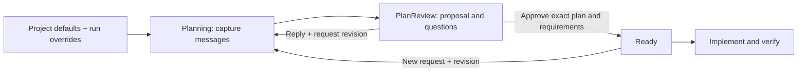

# Planning conversation: user interface

**Today this is a terminal/API interface.** There is no chat panel, push
notification, or connection from Linear comments to this conversation. The
planner's reply appears as a proposal and questions in run status after its
planning attempt finishes.

Project defaults are JSON under `projects.<project>.execution`. Run overrides
replace specified fields at admission. Planning chat adds a reviewed amendment
for this run; it does not rewrite the project configuration.

## What appears at each stage

| Stage | What the user sees | What the user does | Effect |
|---|---|---|---|
| Todo | Empty conversation; `planning_message` is available | Describe special implementation prerequisites or verification checks | Records a message; policy stays unchanged |
| Planning / Autoplanning | Message history; the active planner uses its captured snapshot | Add details if needed | Details arriving after capture need another planning attempt |
| PlanReview, questions | Proposed checks/hosts and `questions` | Reply, then request revision with feedback | Starts a new Planning attempt when the runtime dispatches it |
| PlanReview, ready | Exact plan SHA, requirements digest, additions/removals, no questions | Review the plan and approve both identifiers | Records the approved settings atomically; enters Ready |
| Ready | Approved proposal and effective settings | Continue, or send a new request and return to Planning | New messages prevent implementation under stale approval |
| Implementing / Verifying / Review | Existing proposal/history remains visible | Inspect execution and verification evidence | New planning messages are rejected |



## 1. Find the run and send a request

Use a workflow with the `plan-result-v2` contract, such as `verified-python`.
The following commands run from the repository root, in a second terminal while
[the local factory is running](../SETUP.md#operate-a-running-factory).
Set these values for the existing run; `EXECUTION_ID` is the internal run ID,
not its Linear issue identifier.

```sh
export PYTHONPATH=factory/src
factory_config=/absolute/path/instance.json
factory_project=example
factory_run=EXECUTION_ID

python3 -m dotfactory operator status --config "$factory_config" \
  --project "$factory_project" --execution "$factory_run" > status.json

python3 -m dotfactory operator planning-chat --config "$factory_config" \
  --project "$factory_project" --execution "$factory_run" \
  --expected-state Todo --command-id special-check-1 \
  --message 'Implementation needs Xcode. Verify the onboarding flow on an iOS simulator; ask me which device if needed.'
```

Use the actual `current_state_id` from status as `--expected-state`. A successful
command returns `ok: true` and a completed command receipt. This means the message
was recorded, not that the planner has read it or the requirements were approved.
Reuse the same command ID only to retry the identical request; different content
requires a new ID. Messages must contain 1–8000 characters; a run accepts at most
128 messages.

The owner-only CLI socket carries the local owner's approver authority. If the
factory is stopped, start/resume its owner process before using `operator`.
Stopping at `--until-state PlanReview` also stops that process; it does not leave
the operator socket running. A configured HTTP gateway can instead service a
stopped runtime through its exclusive control owner.

## 2. Read the planner's response

Run `operator status` again. CLI output wraps the snapshot at `data.data`;
HTTP `GET /v1/runs/EXECUTION_ID` wraps it at `data`.

| Snapshot field | Meaning |
|---|---|
| `planning.messages` | Recorded user messages, in order |
| `planning.proposal.proposal.questions` | Planner's unanswered clarification questions |
| `planning.proposal.proposal.checks` | Acceptance criterion → stage → host mappings |
| `planning.proposal.changes` | Each changed field's stage, previous value and proposed value |
| `planning.needs_revision` | Conversation changed since this proposal was prepared |
| `planning.plan_sha` | Exact committed plan to review |
| `planning.proposal.digest` | Exact requirements proposal to review |
| `execution_settings` | Effective settings; proposals do not change them before approval |
| `available_actions` | Actions configured for this state; HTTP authorization still depends on role |

Example display selected from the offline CLI test:

```json
{
  "current_state_id": "PlanReview",
  "questions": ["Which wording should the manual review cover?"],
  "checks": [
    {"criterion": "greeting", "stage": "Verifying", "host": "coordinator"},
    {"criterion": "review", "stage": "Verifying", "host": "manual"}
  ],
  "needs_revision": false
}
```

`needs_revision: false` means the conversation matches the proposal. Questions
can still block approval. The model does not stream assistant chat replies into
`messages`; its answers are the committed plan and structured proposal.

Worker prerequisites belong in a stage's `requires`/`readiness`. Coordinator
prerequisites belong in its `coordinator` contract. Automated pinned Python
checks currently execute on the coordinator. An iOS/cloud/voice request cannot
create a missing executor: the planner must clarify, propose appropriate manual
checks, or use supported coordinator checks. A host label alone is not proof.

## 3. Answer a question and request revision

```sh
python3 -m dotfactory operator planning-chat --config "$factory_config" \
  --project "$factory_project" --execution "$factory_run" \
  --expected-state PlanReview --command-id clarification-2 \
  --message 'Review the greeting and punctuation.'
```

This sets `needs_revision` on the old proposal. It does **not** restart Planning.
Save the following as `revise.json`, then submit it. The workflow requires the
complete durable feedback object, including `url`; a `note` field alone does not
satisfy the revision gate.

```json
{
  "action": "transition",
  "expected_state": "PlanReview",
  "parameters": {
    "to_state": "Planning",
    "owner": "reviewer",
    "feedback": [{
      "source": "control_api",
      "kind": "changes_requested",
      "author": "reviewer",
      "body": "Update the plan using my clarification.",
      "url": "control://commands/revise-plan-2"
    }]
  }
}
```

```sh
python3 -m dotfactory operator command --config "$factory_config" \
  --project "$factory_project" --execution "$factory_run" \
  --command-id revise-plan-2 --request-file revise.json
```

Wait for PlanReview again and read the new proposal. Planning uses its original
admission prerequisites so an unsuitable approved environment cannot prevent a
corrective planning attempt. To revise from Ready, use `expected_state: "Ready"`
and its configured transition to Planning.

## 4. Review and approve

Read `.factory/plan.md` and the proposed checks in the run's workspace. For a
portable review packet, stop the runtime and use a new output directory:

```sh
python3 -m dotfactory delivery --config "$factory_config" \
  --project "$factory_project" --execution "$factory_run" \
  --output /absolute/path/new-review-packet
```

The packet contains `review.json`, `verification-plan.json`, `change.patch`, and
`checks/.factory/planning-requirements.json`. Restart the owner before using the
operator socket again.

After reviewing, save `approve.json` with the full identifiers copied from the
latest status response. Do not approve by copying identifiers without reviewing
their associated plan and changes.

```json
{
  "action": "approve",
  "expected_state": "PlanReview",
  "parameters": {
    "plan_sha": "FULL_REVIEWED_COMMIT_SHA",
    "requirements_digest": "FULL_REVIEWED_REQUIREMENTS_DIGEST",
    "note": "Reviewed the checks, host requirements, and manual steps."
  }
}
```

```sh
python3 -m dotfactory operator command --config "$factory_config" \
  --project "$factory_project" --execution "$factory_run" \
  --command-id approve-plan-2 --request-file approve.json
```

Approval enters Ready. The running scheduler may then start implementation;
approval is not another pause before dispatch. Original admission settings remain
in the ledger. Approved amendments apply to subsequent implementation/verification
attempts and survive restart. Omitted fields inherit; explicit fields replace,
including empty lists that remove configurable requirements.

## HTTP clients

The configured authenticated loopback gateway accepts:

- `GET /v1/runs/EXECUTION_ID`: status, conversation, proposal and actions.
- `POST /v1/runs/EXECUTION_ID/commands`: the same action JSON as above; send an
  `Idempotency-Key` and `Authorization: Bearer …` header.
- Chat request: `{"action":"planning_message","expected_state":"Planning","parameters":{"body":"Also check the fixture data."}}`.

A viewer cannot send messages. An operator can send messages but cannot approve
plans; approval requires an approver. Request headers cannot promote the role.
The gateway rejects browser-origin requests; these endpoints do not constitute
a browser chat UI.

## Errors and next actions

| Error or condition | Action |
|---|---|
| `expected …, found …` | Refresh status; submit a new command for the current state |
| Command ID reused with different inputs | Use a new ID for the new request |
| Questions remain | Reply and request revision; then review the new proposal |
| New messages after capture | Request a planning revision before approval |
| Wrong plan SHA or requirements digest | Review the latest proposal and use both exact identifiers |
| Revision requires durable feedback | Include source, kind, author, body and URL |
| Source/check files changed | Produce a new plan revision; old approval cannot authorize it |
| Missing host prerequisites | Execution is blocked; revise the approved requirements or provide the host |
| Legacy Autoplanning graph has no review edge | Use the updated workflow in a new run; its admitted graph is immutable |
| Planning message after implementation | Rejected; this interface does not interrupt/reconfigure an active implementation |

## Verification boundary

[Interface tests and evidence](../verification/planning-interface.md) cover the
real CLI subprocess, socket, HTTP gateway, prompt builder, Git files and SQLite
approval path. Model-authored interpretation, live Linear chat, simulator/voice
behavior and cloud deployment remain unverified by those offline fixtures.
