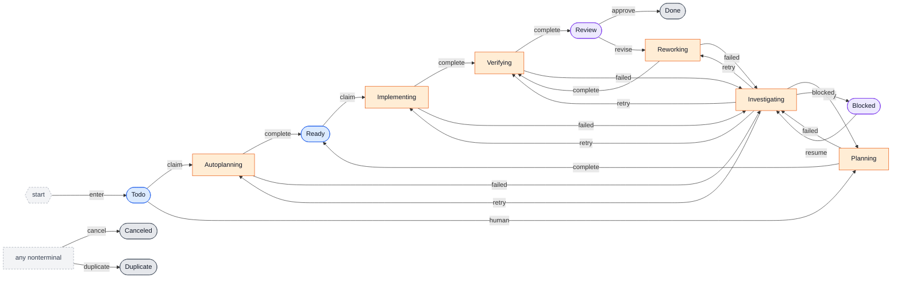

<!-- Generated by render_workflow.py from workflows/default.dot. Do not edit. -->
# dotfactory-default

Workflow digest: `6c162ccb27359e5afbed8e5bc4b6a737d6a7c6056621eb88d84f78f906f2bccc`

## State machine

## States

| ID | Label | Type | Lifecycle | Linear projection | Execution configuration |
|---|---|---|---|---|---|
| Todo | Todo | checkpoint | checkpoint | Todo | — |
| Autoplanning | Autoplanning | work | work | Autoplanning | — |
| Planning | Planning | work | work | Planning | — |
| Ready | Ready | checkpoint | checkpoint | Ready | — |
| Implementing | Implementing | work | work | Implementing | — |
| Verifying | Verifying | work | work | Verifying | — |
| Review | Review | human | checkpoint | Review | — |
| Reworking | Reworking | work | work | Reworking | — |
| Investigating | Investigating | work | work | Investigating | — |
| Blocked | Blocked | human | checkpoint | Blocked | — |
| Done | Done | terminal | checkpoint | Done | — |
| Canceled | Canceled | terminal | checkpoint | Canceled | — |
| Duplicate | Duplicate | terminal | checkpoint | Duplicate | — |

## Edges

| ID | From | To | Evoked by | Signal | Policy |
|---|---|---|---|---|---|
| start.todo | start | Todo | human | linear status change | on=enter |
| todo.autoplanning | Todo | Autoplanning | agent | listener claim | on=claim |
| todo.planning | Todo | Planning | human | linear status change / control command | on=human |
| autoplanning.ready | Autoplanning | Ready | agent | agent handoff | on=complete |
| planning.ready | Planning | Ready | human | linear status change / control command | on=complete |
| ready.implementing | Ready | Implementing | human + agent | linear status change / listener claim / control command | on=claim |
| implementing.verifying | Implementing | Verifying | human + agent | linear status change / agent handoff / control command | on=complete |
| verifying.review | Verifying | Review | human + agent | linear status change / agent handoff / control command | on=complete |
| review.done | Review | Done | human | linear status change / control command | action=approve; on=approve; required_role=approver; requires_feedback=yes; feedback_kind=approval |
| review.reworking | Review | Reworking | human | linear status change / structured comment / control command | on=revise; requires_feedback=yes; feedback_kind=changes_requested |
| reworking.verifying | Reworking | Verifying | human + agent | linear status change / agent handoff / control command | on=complete |
| autoplanning.investigating | Autoplanning | Investigating | agent | recovery requested | on=failed |
| planning.investigating | Planning | Investigating | human | linear status change / control command | on=failed |
| implementing.investigating | Implementing | Investigating | human + agent | linear status change / recovery requested / control command | on=failed |
| verifying.investigating | Verifying | Investigating | human + agent | linear status change / recovery requested / control command | on=failed |
| reworking.investigating | Reworking | Investigating | human + agent | linear status change / recovery requested / control command | on=failed |
| investigating.autoplanning | Investigating | Autoplanning | agent | agent handoff | action=retry; on=retry; condition=resume_state == Autoplanning; confirmation=yes |
| investigating.planning | Investigating | Planning | human | linear status change / control command | action=retry; on=retry; condition=resume_state == Planning; confirmation=yes |
| investigating.implementing | Investigating | Implementing | human + agent | linear status change / agent handoff / control command | action=retry; on=retry; condition=resume_state == Implementing; confirmation=yes |
| investigating.verifying | Investigating | Verifying | human + agent | linear status change / agent handoff / control command | action=retry; on=retry; condition=resume_state == Verifying; confirmation=yes |
| investigating.reworking | Investigating | Reworking | human + agent | linear status change / agent handoff / control command | action=retry; on=retry; condition=resume_state == Reworking; confirmation=yes |
| investigating.blocked | Investigating | Blocked | human + agent | linear status change / agent handoff / control command | on=blocked |
| blocked.investigating | Blocked | Investigating | human | linear status change / structured comment / control command | action=retry; on=resume; confirmation=yes |
| any_nonterminal.canceled | any nonterminal | Canceled | human | linear status change / control command | action=cancel; on=cancel; confirmation=yes |
| any_nonterminal.duplicate | any nonterminal | Duplicate | human + agent | linear status change / agent handoff / control command | on=duplicate; confirmation=yes |

## Runtime contract

- Checkpoint nodes may wait without an active attempt.
- Work nodes require an owned attempt and evidence before completion.
- Node IDs are stable internal identity; `label` and `linear_status` are projections.
- The resolved workflow and node configuration are snapshotted by digest per execution.
- Only edges in this graph may be accepted by the kernel.
